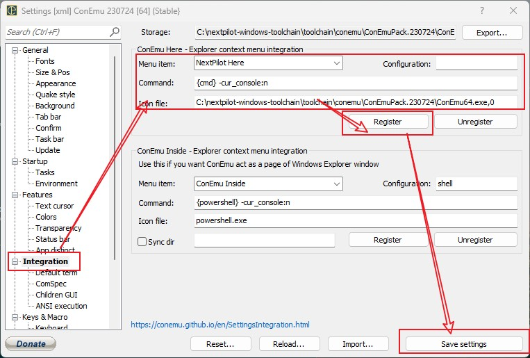

# Nextpilot Develop Toolchain for Windows

`nextpilot-windows-toolchain` 是 `nextpilot-flight-control` 在 `windows` 平台下的开发工具链，主要集成了以下开发工具：

|工具|版本|路径|
|---|---|---|
|python|python-3.11.9-amd64|toolchain/python/python-3.11.9-amd64|
|gcc-arm|gcc-arm-none-eabi-10.3-2021.10|toolchain/gcc/gcc-arm-none-eabi-10.3-2021.10|
|qemu|qemu-w64-v8.2.0|toolchain/qemu/qemu-w64-v8.2.0|
|git|MinGit-2.42.0.2-64-bit|toolchain/git/MinGit-2.42.0.2-64-bit|
|conemu|ConEmuPack.230724|toolchain/conemu/ConEmuPack.230724|

## 目录结构

```
├─document
├─rtthread         # 保存env工具链和代码
│  ├─packages      # rtt软降包索引
│  └─tools/scripts # env python脚本
├─toolchain        # 第三方工具链，主要是python/arm-gcc等
│  ├─gcc           # arm-gcc，用于编译固件
│  ├─git           # git-for-windows，用于版本管理
│  ├─mconf         # kconfig-frontends，在windows下使用kconfig
│  ├─python        # python，已经添加了所需的模块
│  ├─qemu          # qemu，硬件模拟器，用于运行飞行仿真
│  ├─conemu        # coemu，命令行终端（集成了clink）
│  └─vscode        # vscode，文本编辑器，已安装所需的插件
└─workspace        # 工作目录
```

## 如何使用

1 下载工具链到`c:\nextpilot-windows-toolchain`，**当前只支持该路径**，不支持其它自定义路径哈，否则会报错找不到python.exe

> 原因是：安装pip软件包时会将python绝对路径的写入exe文件中，工具链中预装pip包时用的路径是`c:\nextpilot-windows-toolchain`，如果将toolchain安装到其它路径，运行`scons.exe`等工具的时候会提示找不到`C:\nextpilot-windows-toolchain\toolchain\python\python-3.11.9-amd64\python.exe`，告警信息如下：

```bat
Fatal error in launcher: Unable to create process using '"C:\nextpilot-windows-toolchain\toolchain\python\python-3.11.9-amd64\python.exe"  "D:\nextpilot-windows-toolchain\toolchain\python\python-3.11.9-amd64\Scripts\scons.exe" ': ???????????
```

2 双击根目录下的`start.bat`脚本（为了方便下次使用，建议将start.bat添加桌面快捷方式），启动终端。如果已经将 NextPilot 添加到 Windows 右键菜单，那么可以在`bsps/sitl/qemu`文件夹上`点击鼠标右键` 选择 `NextPilot Here`方式启动终端。


```bat

******************************************************************
*      _   __             __   ____   _  __        __
*     / | / /___   _  __ / /_ / __ \ (_)/ /____   / /_
*    /  |/ // _ \ | |/_// __// /_/ // // // __ \ / __/
*   / /|  //  __/_>  < / /_ / ____// // // /_/ // /_
*  /_/ |_/ \___//_/|_| \__//_/    /_//_/ \____/ \__/
*
* Copyright All Reserved (C) 2015-2024 NextPilot Development Team
******************************************************************

Clink v1.6.14 is available.
- To apply the update, run 'clink update'.
- To stop checking for updates, run 'clink set clink.autoupdate off'.
- To view the release notes, visit the Releases page:
  https://github.com/chrisant996/clink/releases

LaterComer@DESKTOP-JTKLBS9 C:\nextpilot-flight-control-public\bsps\sitl\qemu
```

3 在cmd中切换到`nextpilot-flight-control`的bsp目录，然后执行配置、编译、仿真等

```bat
rem 切换到sitl虚拟飞行仿真目录
cd nextpilot-flight-control\bsps\sitl\qemu

rem 配置编译模块，非必须
scons --menuconfig
scons default --menuconfig

rem 生成keil工程
scons --target=mdk5
scons default --target=mdk5

rem 编译固件
scons -j10
scons default -j10

rem 启动仿真
qemu.bat
```

> 注意：`bsps/sitl/qemu/config/`文件夹下面保存了很多`*.config`文件（比如default.config），`scons default`表示使用`default.config`配置文件

## 常见问题

### 添加到右键菜单

打开 `ConEmu > Settings...` 设置页面，按照下图所示可以添加右键快捷菜单：

- Menu item：`NextPilot Here`
- Command：`{cmd} -cur_console:n`
- Icon file：`C:\nextpilot-windows-toolchain\toolchain\conemu\ConEmuPack.230724\ConEmu64.exe,0`



### 集成到Windows Terminal

打开 `Windows Termial > 设置` 设置页面，选择`添加新配置文件`，按照如下填写

- 名称：`NextPilot Windows Toolchain`
- 命令行：`cmd.exe /k C:\nextpilot-windows-toolchain\init.bat`
- 其它设置，全部保持默认即可


> 为了方便使用，建议将 NextPilot Windows Toolchain 设置为默认终端，设置方式是： `Windows Terminal > 设置 > 启动 > 默认配置文件`，

### 安装其它pip模块

工具链默认已集成 NextPilot 开发所需的所有pip包，请参考[requirements.txt](./toolchain/python/requirements.txt)。
如果还希望安装其他模块，直接通过`pip install`安装即可。如果是国内环境，建议切换pip源为：

```bat
rem 使用清华大学pip源
pip config set global.index-url https://pypi.tuna.tsinghua.edu.cn/simple

rem 使用阿里云pip源
pip config set global.index-url https://mirrors.aliyun.com/pypi/simple/

```

### 切换python版本

当前已集成了`python-3.11.9-amd64`，由于项目中部分依赖的软件包仅支持python3，因此nextpilot不支持python2。如果希望切换到其它python版本，请参考[toolchain/python/README.md](toolchain/python/README.md)安装python后，再修改[init.bat](init.bat)中python路径为新的python路径即可。

### 切换arm-gcc版本

当前已集成了`gcc-arm-none-eabi-10.3-2021.10`，安装其他版本gcc-arm请参考[toolchain/gcc/README.md](toolchain/gcc/README.md)，并将[init.bat](init.bat)中关于gcc-arm的路径修改为新版本gcc-arm路径。
