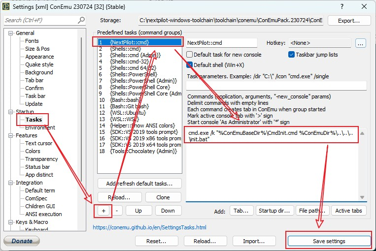

# ConEmu

ConEmu下载地址：<https://github.com/Maximus5/ConEmu/releases>

Clink下载地址：<https://github.com/chrisant996/clink/releases>

1. 下载[ConEmuPack.230724.7z](https://github.com/Maximus5/ConEmu/releases/download/v23.07.24/ConEmuPack.230724.7z)并解压到`toolchain\conemu\ConEmuPack.230724`

2. 下载[clink.1.6.16.c5eaf9.zip](https://github.com/chrisant996/clink/releases/download/v1.6.16/clink.1.6.16.c5eaf9.zip)并解压到`toolchain\conemu\ConEmuPack.230724\ConEmu\clink`

## 添加 NextPilot 启动任务

按照下图所示，为ConEmu添加NextPilot Task，便于快速加载NextPilot开发环境。

在 Commands 编辑框里面填写如下内容：

```bat
cmd.exe /k "%ConEmuBaseDir%\CmdInit.cmd %ConEmuDir%\..\..\..\init.bat"
```

> 创建NextPilot Task时，先执行`%ConEmuBaseDir%\CmdInit.cmd`，然后运行`%ConEmuDir%\..\..\..\init.bat`。init.bat脚本是准备NextPilot开发工具链（比如环境变量）



## 创建 NextPilot 右键菜单

按照下图所示可以添加右键快捷菜单：

- Menu item：`NextPilot Here`
- Command：`{cmd} -cur_console:n`
- Icon file：`C:\nextpilot-windows-toolchain\toolchain\conemu\ConEmuPack.230724\ConEmu64.exe,0`


